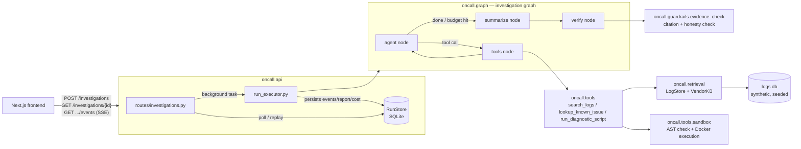

# Architecture overview



## Layers, and why the boundaries are enforced

The import-linter contract in `pyproject.toml` (checked by `make imports`)
fixes a strict layering:

```
api -> graph -> guardrails -> tools -> retrieval -> schemas
```

A higher layer may import a lower one, never the reverse, and a second
contract forbids `tools`, `guardrails`, and `retrieval` from importing
`graph` at all. Concretely, this means:

- **`oncall.tools`** only ever sees the read-only `logs` table (via
  `LogStore.query`) — it can never reach the `incidents`/`fixtures` ground
  truth tables that exist purely for evals.
- **`oncall.guardrails`** is pure code with no model call and no tool
  access; it only inspects the `IncidentReport` and the recorded message
  history after the fact.
- **`oncall.graph`** is the only layer allowed to wire an LLM, the tools,
  and the guardrail together — no other layer can silently reach into an
  LLM or invent evidence.
- **`oncall.store`** (the operational run/event/cost persistence layer) is
  deliberately *not* part of this contract — it's infrastructure the API
  layer owns directly, not part of the investigation's reasoning path.

See the [ADRs](../adr/d-a5-1-domain-and-repo.md) for the specific decisions
behind each layer, and [state and flow](state-and-flow.md) for what happens
inside the graph box above.
