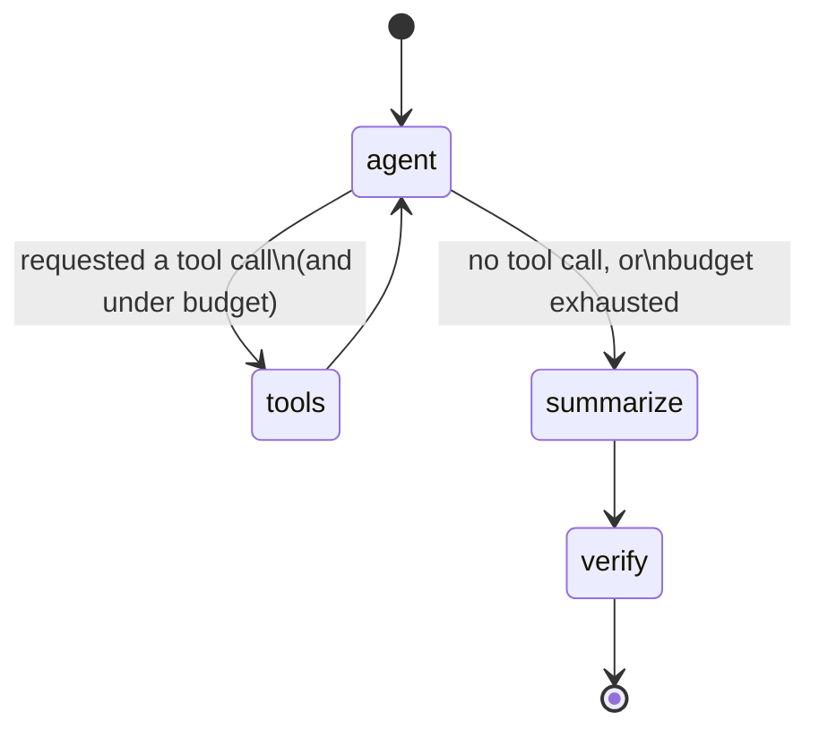

# State and flow

## `InvestigationState`

```python
class InvestigationState(TypedDict, total=False):
    question: str
    messages: Annotated[list[BaseMessage], add_messages]
    started_at: float
    report: IncidentReport  # present only once `summarize` has run
```

`messages` accumulates the full LangChain message history — the original
question, every LLM turn, and every tool result — across the whole run;
`add_messages` is LangGraph's standard message-list reducer, so each node
only returns the *new* messages it produced.

## Node flow



| Node | Does | Source |
|---|---|---|
| `agent` | One LLM turn, bound to `search_logs` / `lookup_known_issue` / `run_diagnostic_script`. Prepends the system prompt on the first turn. | `oncall.graph.nodes.build_agent_node` |
| `tools` | Executes whatever tool call(s) the agent just requested (LangGraph's prebuilt `ToolNode`). | `langgraph.prebuilt.ToolNode` |
| *(routing)* | After `agent`, routes to `tools` if a tool call is pending and the run is under budget (`max_tool_calls`, `max_run_seconds`); otherwise routes to `summarize` — including when the budget itself is what stopped it. | `oncall.graph.nodes.build_route_after_agent` |
| `summarize` | One final structured-output LLM turn: drafts the `IncidentReport` from the full accumulated history. | `oncall.graph.nodes.build_summarize_node` |
| `verify` | Pure code, no model call: downgrades the report to `insufficient_evidence` if its citations don't resolve to real tool results, or if it makes a severity claim with no anomalous evidence. | `oncall.graph.nodes.build_verify_node` -> `oncall.guardrails.evidence_check.verify_report` |

The `agent` <-> `tools` loop can repeat multiple times in one run (the
agent might search logs, then look up a known issue, then search logs
again) — the budget guardrail is what guarantees it always terminates.

See [D-A5-3](../adr/d-a5-3-sandboxing.md) for `run_diagnostic_script`'s
two-stage AST-check-then-Docker-sandbox design, and
[D-A5-4](../adr/d-a5-4-evidence-and-honesty-guardrail.md) for exactly what
`verify` checks.
