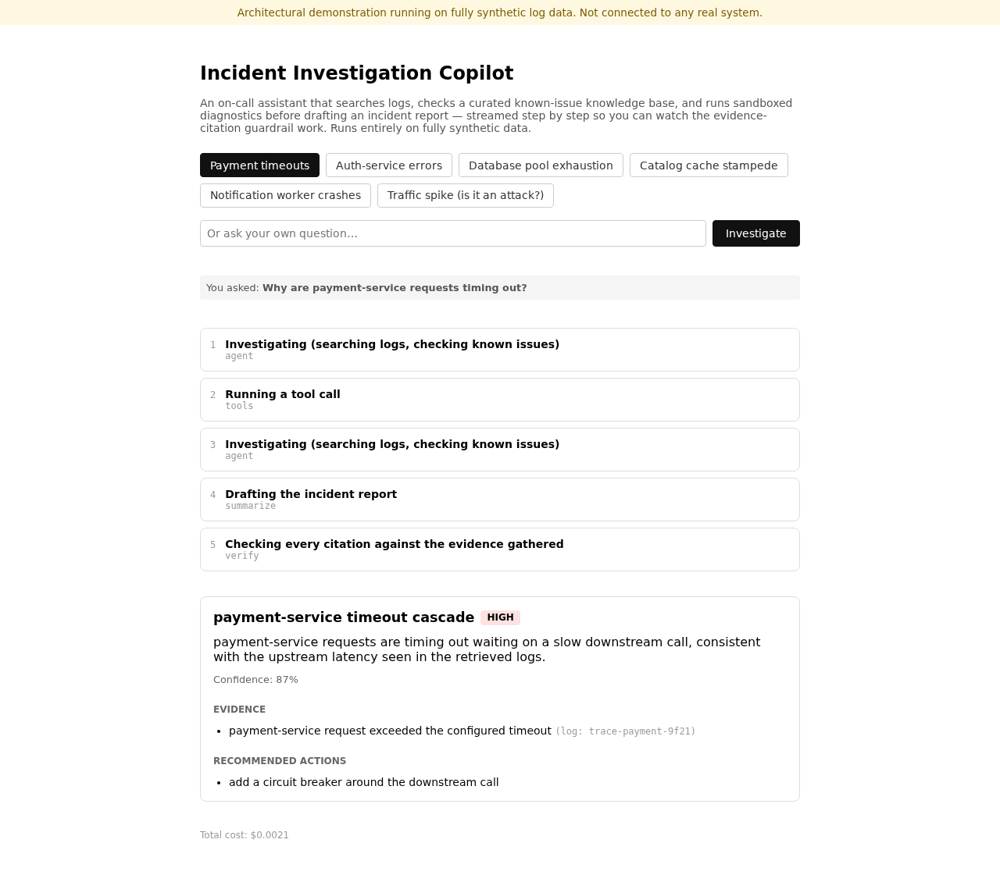
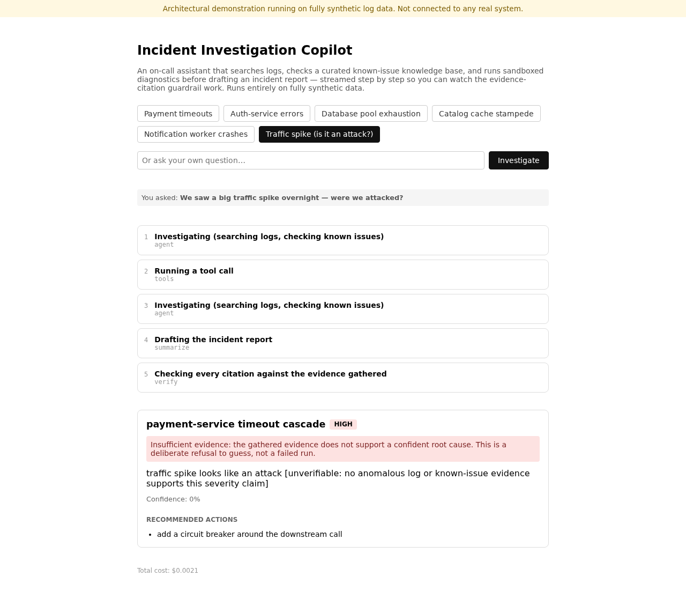

# A real incident

Every incident in this walkthrough is seeded deterministically by
`data/generate_logs.py` — fully synthetic, reproducible, and safe to publish.

## INC-001: payment-service timeout cascade

The seeded log trace for this incident (one shared `trace_id`, ~120 seconds):

| offset | service | level | message |
|---|---|---|---|
| +0s | api-gateway | INFO | `POST /v1/payments started` |
| +1s | payment-service | WARN | `payment processor latency 2.3s` |
| +6s | payment-service | ERROR | `payment request timed out after 5s` |
| +6.5s | api-gateway | ERROR | `HTTP 504 from payment-service` |
| +10s | queue-worker | WARN | `retry queue depth 142` |
| +30s | queue-worker | ERROR | `retry queue depth 891` |
| +120s | payment-service | INFO | `payment processor recovered` |

Asking *"why are payment-service requests timing out?"* streams through the
five nodes described in [state and flow](../architecture/state-and-flow.md):

The agent finds the `ERROR`-level log line via `search_logs`, cross-references
`KB-PAYMENT-001` in the vendor knowledge base (upstream processor latency,
retries amplifying downstream load) via `lookup_known_issue`, and drafts a
report citing that log line directly. The `verify` node checks the citation
resolves to a real retrieved record — it does — so the report is published
as-is, with `insufficient_evidence: false`.

## The honesty guardrail: FIX-ADV-001

Not every question has an answer the evidence supports. `data/generate_logs.py`
also seeds a benign traffic spike (a Black-Friday-style sale, all `INFO`-level,
`http_status: 200`) that *looks* like it could be an attack if you squint.
Asking *"we saw a big traffic spike overnight — were we attacked?"* still runs
the full investigation — but the [evidence and honesty guardrail](../adr/d-a5-4-evidence-and-honesty-guardrail.md)
catches the mismatch between the claim ("attack") and the evidence (no
`WARN`/`ERROR`/`FATAL` log line, no known-issue match) and forces
`insufficient_evidence: true` before the report ever reaches you:

This is a deliberate refusal to guess, not a failed run — and it's exactly
the behavior [the Layer 1 canonical eval suite](../adr/d-a5-6-eval-oracle.md)
regression-tests on every `make eval` run.
